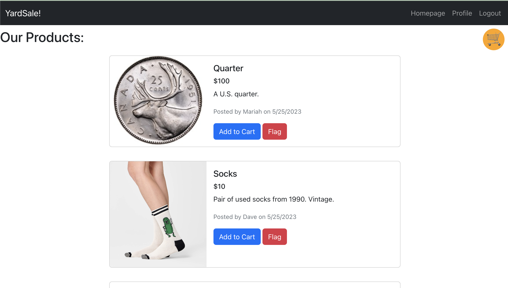
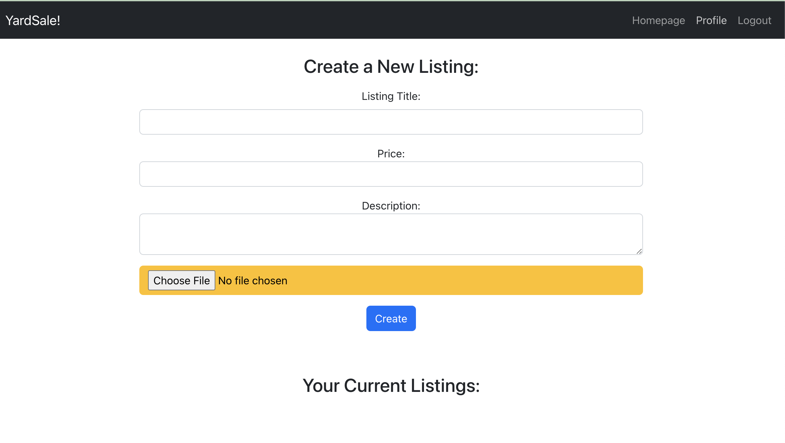
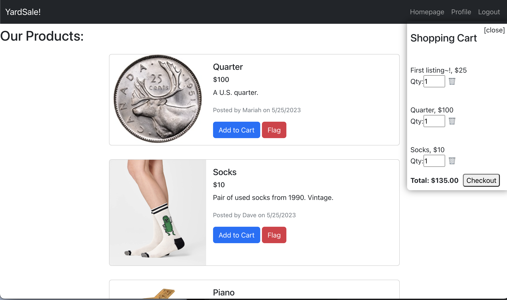
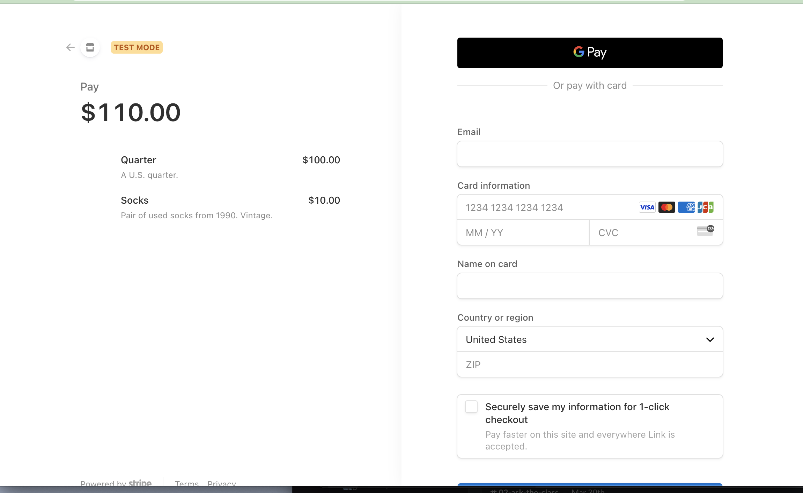

# Yard Sale 2.0
This project was designed to help users purchase premium items through a website where other users no longer need their items. 

By: Mariah Wear, David Lee, Sam Cott, Rances Rodriguez, Jordy Marquez

## Table of contents

- [Overview](#overview)
  - [The challenge](#the-challenge)
  - [Screenshot](#screenshot)
  - [Links](#links)
- [My process](#my-process)
  - [Built with](#built-with)
  - [What I learned](#what-i-learned)
  - [Continued development](#continued-development)
- [Author](#author)
- [Acknowledgments](#acknowledgments)


## Overview

### The challenge
The challenge was to work together within a single github repository to build a functional full-stack application utilizing React.

## User Story
```
AS a buyer or seller of fine goods
I WANT to be able to purchase used items as well as having the ability to sell my own items
SO THAT i can continue to have the things i want and recycle the things I do not need
```
## Acceptance Criteria
```
GIVEN an interactive classifieds webpage 

WHEN I view the home page
THEN I see all the current for-sale listings

WHEN I click create a listing
THEN I can upload an image and item details which are posted to the site

WHEN I view a listings detail
THEN I see its image, price and description, and can click a button to purchase

WHEN I click to purchase an item and I'm logged in
THEN I see a modal to confirm or exit

When I try to purchase and I'm logged out
THEN I'm prompted to log in or sign up

WHEN I confirm my purchase
THEN the item is marked as sold and can no longer be purchased
```

### Screenshot

Homepage:

Profile:

Cart:

Checkout Screen:



### Links

- Solution URL: [Github Repo](https://github.com/mariahw4/yardsale-2.0)
- Live Site URL: [Deployed on Heroku](https://yardsale-2-application.herokuapp.com/)

## Our process

### Built with

- Semantic HTML5 markup
- CSS custom properties
- Mobile-first workflow
- [React](https://reactjs.org/) - JS library
- [Next.js](https://nextjs.org/) - React framework
- [Styled Components](https://styled-components.com/) - For styles

## Available Scripts

In the project directory, you can run:

### `npm start`

Runs the app in the development mode.\
Open [http://localhost:3000](http://localhost:3000) to view it in your browser.

The page will reload when you make changes.\
You may also see any lint errors in the console.

### `npm test`

Launches the test runner in the interactive watch mode.\
See the section about [running tests](https://facebook.github.io/create-react-app/docs/running-tests) for more information.

### `npm run build`

Builds the app for production to the `build` folder.\
It correctly bundles React in production mode and optimizes the build for the best performance.

The build is minified and the filenames include the hashes.\
Your app is ready to be deployed!

See the section about [deployment](https://facebook.github.io/create-react-app/docs/deployment) for more information.


### What we learned

We learned that it is fairly challening to convert an application from the MVC format into a full stack react app.  


### Continued development

Future development plans include fixing image upload functionality, adding a delete and update listing button, finishing out the flag listing function so users can flag inappropriate listings they'd like the admin to remove.  


## Author

- [Sam Cott - Github Profile](https://github.com/samc995)
- [David Lee - Github Profile](https://github.com/kpxcrew)
- [Jordy Marquez - Github Profile](https://github.com/JordyMarquez)
- [Mariah Wear - Github Profile](https://github.com/mariahw4)
- [Rance Rodriguez - Github Profile](https://github.com/Caliza)


## Acknowledgments

We want to thank our tutors and a big thanks to Mark and our TA's for the program and assistance on chasing bugs in this project!! 
